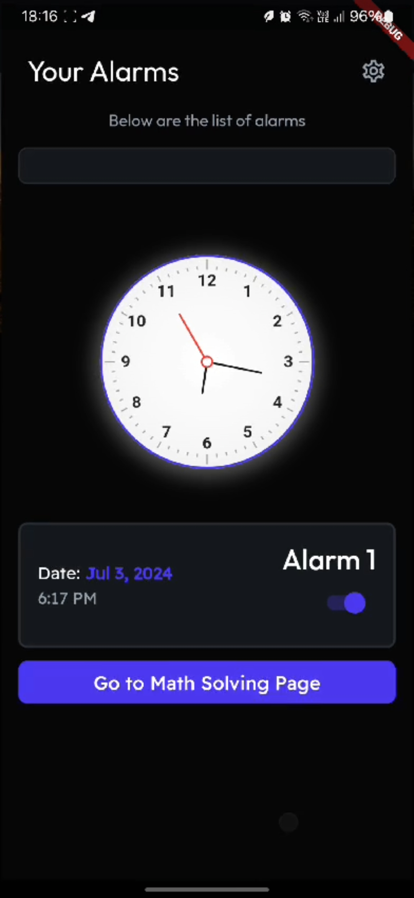
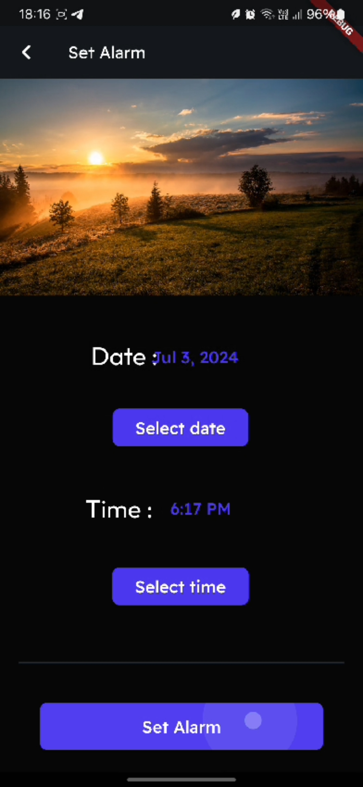
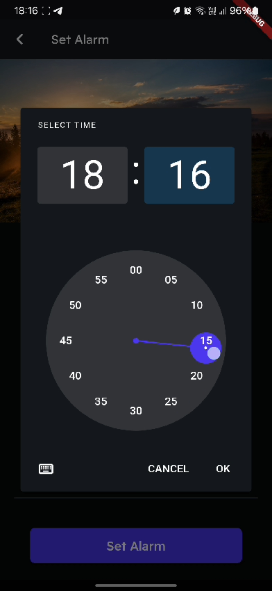
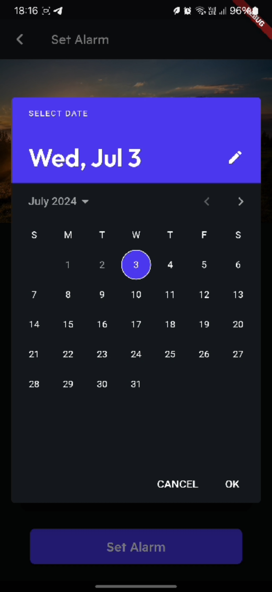
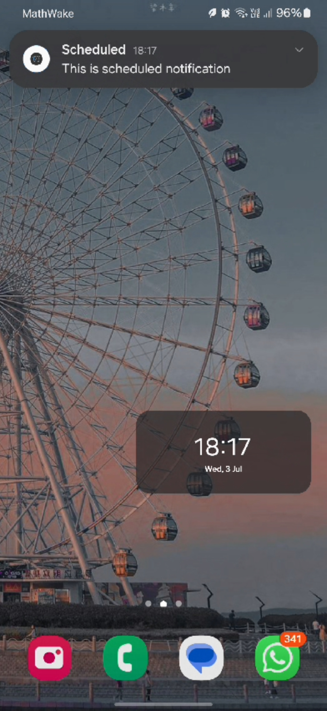
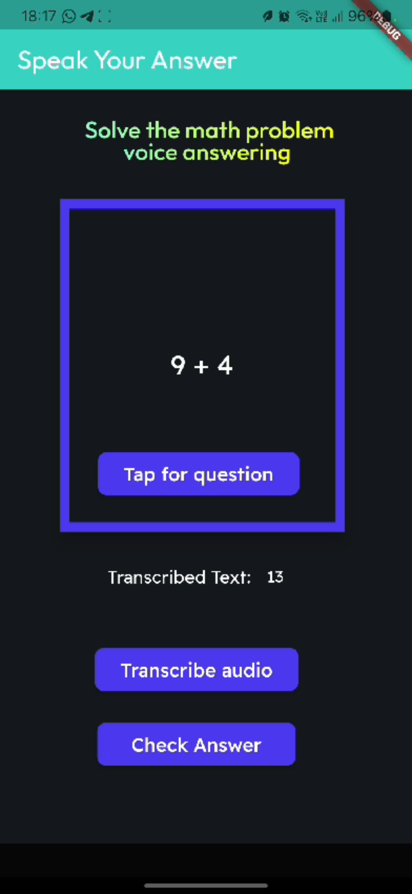
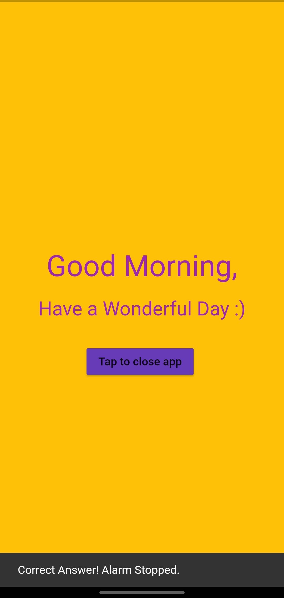
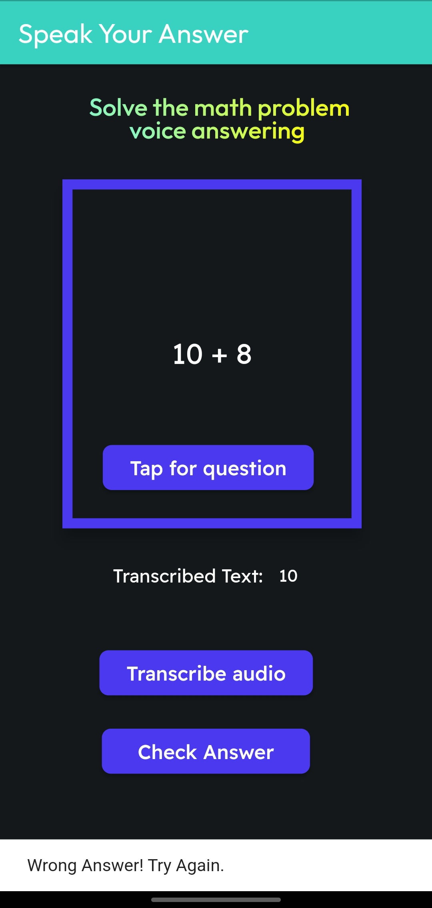
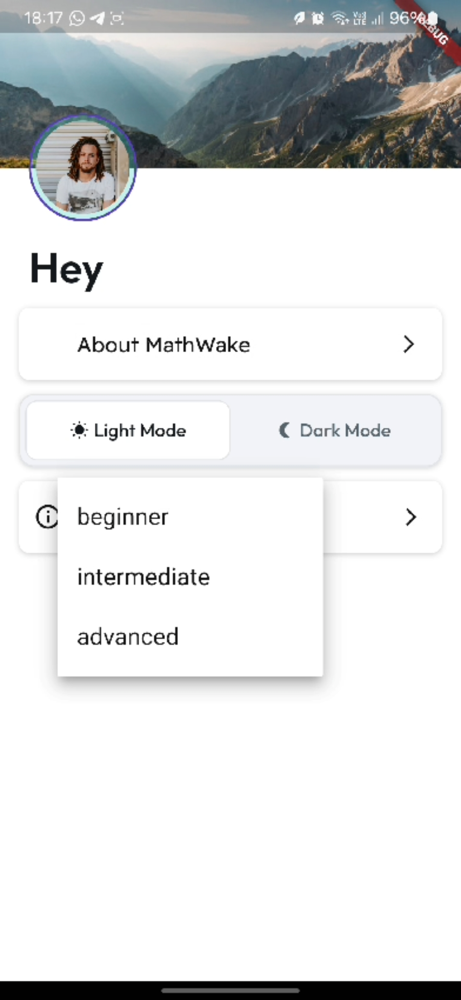

# 📱 Smart Alarm App

A smart alarm app developed using Flutter and FlutterFlow that helps you wake up by solving math problems. The alarm only stops ringing once you speak out the correct answer to a math problem displayed on the screen.

## 🚀 Project Overview

This project was developed as part of a mini-project for the 3rd year BTech CS degree. It combines features like customizable difficulty levels for math problems and a live analog clock displaying real-time, providing a unique and interactive alarm experience.

## 🎯 Key Features

- **Math Problem-Based Alarm:** The alarm stops only when the user correctly speaks out the answer to the displayed math problem.
- **Difficulty Levels:** Choose between beginner, intermediate, and advanced math problem difficulty.
- **Real-Time Analog Clock:** Displays real-time using a live analog clock interface.
- **Customizable Alarm Settings:** Users can set alarms with ease and select the difficulty level for their math problem.

## 🛠️ Tech Stack

- **Framework:** Flutter
- **UI Development:** FlutterFlow
- **Local Setup:** Android Studio

## 🚀 Getting Started
To run this project locally:

1. Clone the repository:
```
git clone https://github.com/yourusername/smart-alarm-app.git
```
2. Navigate to the project directory:
```
cd smart-alarm-app
```
3. Install dependencies:
```
flutter pub get
```
4. Run the app:
```
flutter run
```
## 📸 Screenshots

<table>
  <tr>
    <td>
      
      <br> <b>Landing Page</b><br>Home screen of the app.
    </td>
    <td>
      
      <br> <b>Alarm List Page</b><br>Displays all active alarms.
    </td>
    <td>
      
      <br> <b>Set Alarm Page</b><br>Allows users to set a new alarm.
    </td>
  </tr>
  <tr>
    <td>
      
      <br> <b>Select Time Page</b><br>Time selection screen.
    </td>
    <td>
      
      <br> <b>Select Date Page</b><br>Date selection screen.
    </td>
    <td>
      
      <br> <b>Notification Displaying</b><br>Shows how the notification appears.
    </td>
  </tr>
  <tr>
    <td>
      
      <br> <b>Alarm Landing Page</b><br>Opens when clicking the alarm notification.
    </td>
    <td>
      
      <br> <b>Speech Recognition Page</b><br>Voice input for alarm dismissal.
    </td>
     <td>
      
      <br> <b>Correct Answer Page</b><br>Shown when the answer is correct.
    </td>
  </tr>
  <tr>
    <td>
      
      <br> <b>Wrong Answer Page</b><br>Shown when the answer is incorrect.
    </td>
    <td>
      
      <br> <b>Settings Page</b><br>Customization options.
    </td>
    <td>
      
      <br> <b>About App Page</b><br>Displays app details.
    </td>
  </tr>
</table>


